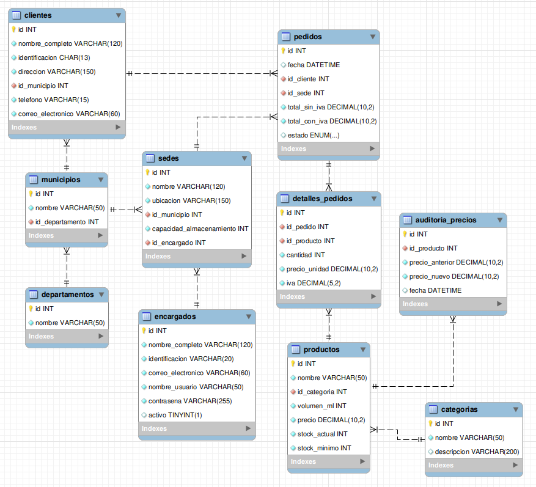

# Base de Datos - Distribuidora de Gaseosas del Valle S.A.

## Introducción

Este proyecto contiene la implementación de una base de datos en MySQL para gestionar las operaciones de una empresa distribuidora de bebidas. El diseño abarca desde la gestión de inventario y ventas hasta la automatización de procesos de negocio mediante funciones, triggers y eventos.

El objetivo principal es proporcionar una solución de base de datos robusta, normalizada y eficiente que cumpla con los requerimientos funcionales del negocio.

---

## Estructura del Proyecto

El repositorio está organizado en carpetas, cada una con una responsabilidad específica, para mantener el código SQL modular y ordenado.

```
├── database/
│   ├── ddl/
│   │   └── schema.sql         # (DDL) Estructura de tablas y relaciones
│   ├── dml/
│   │   └── data.sql           # (DML) Inserción de datos de prueba
│   └── dql/
│       └── views_and_queries.sql # (DQL) Consultas y Vistas
├── docs/
│   └── requirements.md        # Documentación de requerimientos
├── events/
│   └── events.sql             # Scripts para eventos programados
├── functions/
│   └── functions.sql          # Scripts para funciones almacenadas
├── indexes/
│   └── indexes.sql            # Scripts para la creación de índices
├── transactions/
│   └── transactions.sql       # Scripts para procedimientos y transacciones
├── triggers/
│   └── triggers.sql           # Scripts para triggers
├── results.md                 # Resultados de las pruebas
└── README.md                  # Este archivo
```

---

##  Diagrama Entidad-Relación (ERD)


---

## Componentes Implementados

El proyecto implementa varios objetos de base de datos para cumplir con los [requerimientos funcionales](./docs/requirements.md):

*   **Funciones:**
    *   `fn_calcular_total_con_iva`: Calcula el total de un pedido incluyendo el IVA.
    *   `fn_validar_stock`: Verifica la disponibilidad de un producto antes de una venta.
*   **Triggers:**
    *   `tr_after_actualizar_stock`: Descuenta el stock de un producto automáticamente después de una venta.
    *   `tr_after_auditar_cambio_precio`: Registra cualquier modificación en el precio de los productos en una tabla de auditoría.
*   **Transacciones (Procedimientos Almacenados):**
    *   `sp_comprar`: Encapsula todo el proceso de compra en una transacción atómica para garantizar la integridad de los datos.
*   **Vistas:**
    *   `vista_resumen_pedidos_por_sede`: Ofrece un resumen de ventas y pedidos por cada sede.
    *   `vista_productos_bajo_stock`: Lista los productos que necesitan reabastecimiento urgente.
    *   `vista_clientes_activos`: Segmenta a los clientes según su historial de compras.
*   **Eventos:**
    *   `evento_revisar_stock`: Tarea programada que se ejecuta diariamente para registrar productos con bajo inventario en una tabla de logs.

---

## Resultados y Evidencias

Para verificar el correcto funcionamiento de cada componente, consulta el archivo **results.md**. En él encontrarás las pruebas de ejecución y los resultados obtenidos para cada función, trigger, vista y procedimiento del proyecto.

Autora: Jakelin Quino
