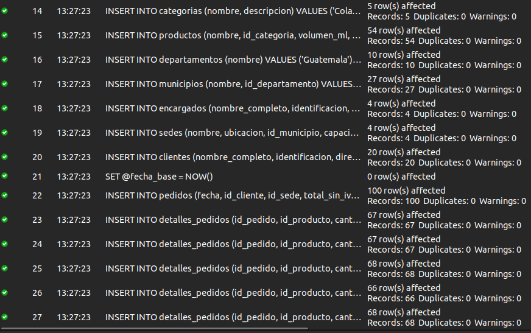
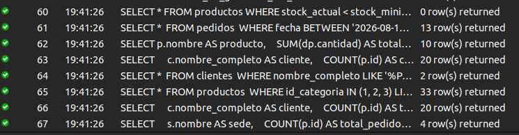
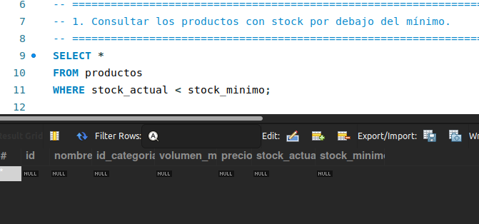
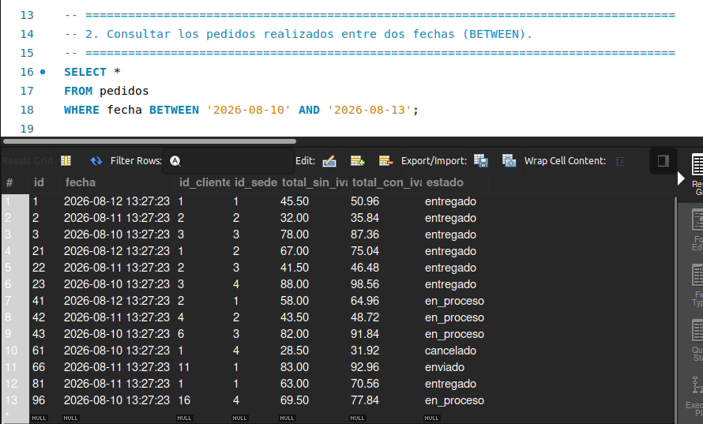
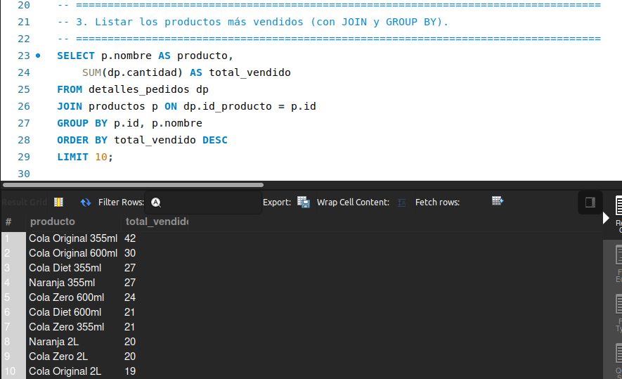
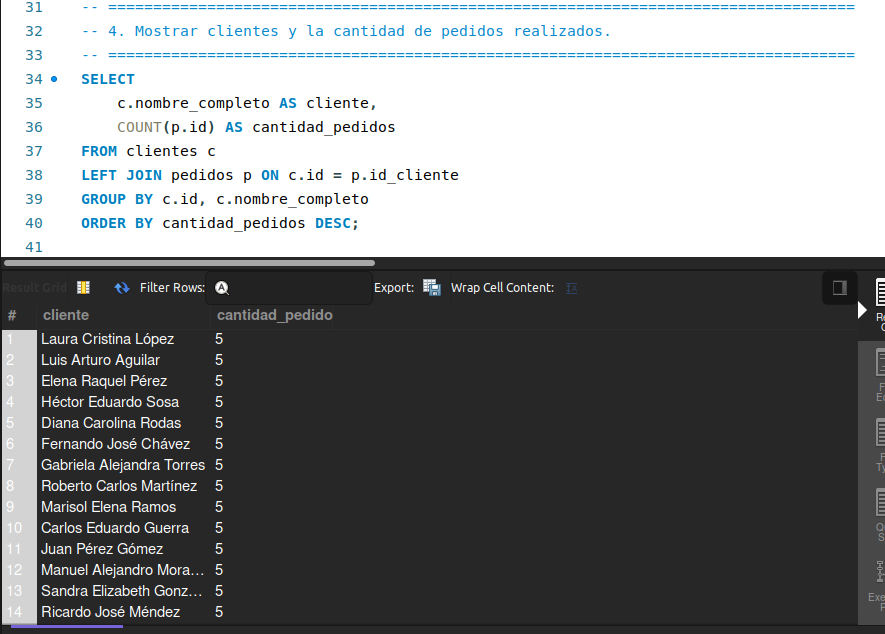
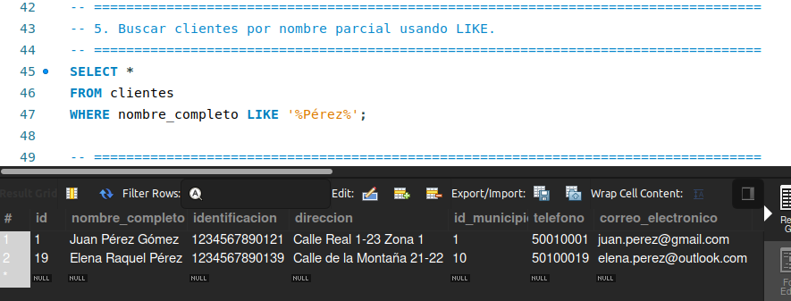
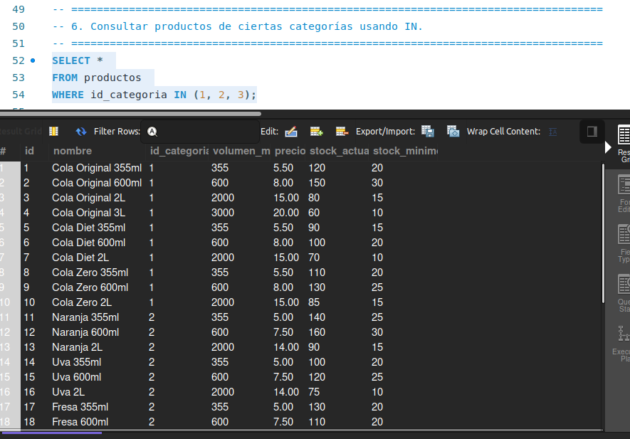
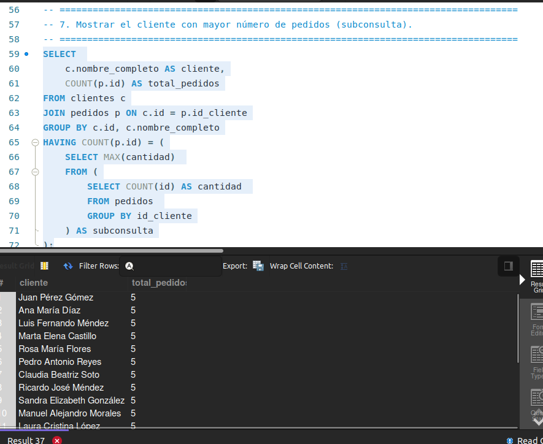
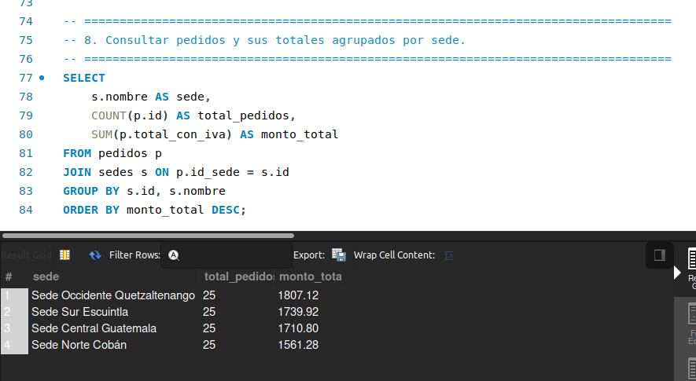

# Resultados del Proyecto

En este documento se presentan los resultados de la implementación y el funcionamiento de los diferentes componentes de la base de datos `distribuidora_de_gaseosas_del_valle`. Cada sección corresponde a un tipo de objeto de la base de datos (funciones, triggers, consultas, etc.) y muestra tanto el código de prueba ejecutado como los resultados obtenidos.

---
## 0. Creación de la base de datos e insersión de datos



## 1. Funciones (CREATE FUNCTION)

Se crearon dos funciones para cumplir con los requerimientos de negocio.

### `fn_calcular_total_con_iva`
**Objetivo:** Calcular el monto total de un pedido, incluyendo el 12% de IVA.

**Prueba de ejecución:**
Se verifica el cálculo del total con IVA para los primeros 5 pedidos y se compara con el valor almacenado.

```sql
SELECT 
    id, 
    total_sin_iva, 
    total_con_iva,
    fn_calcular_total_con_iva(id) AS total_calculado
FROM pedidos
WHERE id BETWEEN 1 AND 5;
```

**Resultado:**
La función `total_calculado` devuelve el mismo valor que el campo `total_con_iva`, validando que el cálculo es correcto.

```plaintext
+----+---------------+---------------+------------------+
| id | total_sin_iva | total_con_iva | total_calculado  |
+----+---------------+---------------+------------------+
|  1 |         45.50 |         50.96 |            50.96 |
|  2 |         32.00 |         35.84 |            35.84 |
|  3 |         78.00 |         87.36 |            87.36 |
|  4 |         55.50 |         62.16 |            62.16 |
|  5 |         25.00 |         28.00 |            28.00 |
+----+---------------+---------------+------------------+
```

### `fn_validar_stock`
**Objetivo:** Verificar si hay suficiente stock de un producto antes de realizar una venta.

**Prueba de ejecución:**
Se comprueba la disponibilidad para una solicitud de 10 unidades del producto con ID 1.

```sql
SELECT fn_validar_stock(1, 10) AS validacion;
```

**Resultado:**
La función indica correctamente que el stock es suficiente, ya que el stock inicial es de 120.

```plaintext
+----------------------------------------------------------------------+
| validacion                                                           |
+----------------------------------------------------------------------+
| Stock disponible. Cantidad solicitada: 10. Stock actual: 120         |
+----------------------------------------------------------------------+
```

---

## 2. Triggers (CREATE TRIGGER)

Se implementaron triggers para automatizar la actualización de stock y auditar cambios de precios.

### `tr_after_actualizar_stock`
**Objetivo:** Descontar automáticamente el stock de un producto después de insertar un nuevo detalle de pedido.

**Prueba de ejecución:**
1. Se consulta el stock inicial del producto con ID 1.
2. Se inserta un detalle de pedido por 5 unidades de ese producto.
3. Se vuelve a consultar el stock para verificar la actualización.

```sql
-- 1. Stock inicial
SELECT stock_actual FROM productos WHERE id = 1;
-- Resultado: 120

-- 2. Inserción
INSERT INTO detalles_pedidos (id_pedido, id_producto, cantidad, precio_unidad)
VALUES (1, 1, 5, 5.50);

-- 3. Stock final
SELECT stock_actual FROM productos WHERE id = 1;
-- Resultado: 115
```

**Resultado:**
El stock del producto se redujo de 120 a 115 unidades, confirmando que el trigger funciona correctamente.

### `tr_after_auditar_cambio_precio`
**Objetivo:** Registrar en una tabla de auditoría cada vez que el precio de un producto es modificado.

**Prueba de ejecución:**
1. Se actualiza el precio del producto con ID 1 de `5.50` a `6.50`.
2. Se consulta la tabla `auditoria_precios` para verificar que el cambio fue registrado.

```sql
-- 1. Actualizar precio
UPDATE productos SET precio = 6.50 WHERE id = 1;

-- 2. Verificar auditoría
SELECT id_producto, precio_anterior, precio_nuevo, fecha
FROM auditoria_precios
WHERE id_producto = 1;
```

**Resultado:**
La tabla de auditoría contiene un nuevo registro con el precio anterior y el nuevo, junto con la fecha del cambio.

```plaintext
+-------------+-----------------+--------------+---------------------+
| id_producto | precio_anterior | precio_nuevo | fecha               |
+-------------+-----------------+--------------+---------------------+
|           1 |            5.50 |         6.50 | 2026-08-14 03:02:32 |
+-------------+-----------------+--------------+---------------------+
```

---

## 3. Transacciones (Stored Procedure)

Se desarrolló un procedimiento almacenado para gestionar el proceso de compra de forma atómica y segura.

### `sp_comprar`
**Objetivo:** Encapsular la lógica de una compra (crear pedido, insertar detalle, actualizar stock) dentro de una transacción.

**Prueba de ejecución:**
Se simula una compra de 2 unidades del producto 1 para el cliente 1.

```sql
-- 1. Stock antes de la compra
SELECT stock_actual FROM productos WHERE id = 1;
-- Resultado: 115 (considerando la prueba del trigger anterior)

-- 2. Ejecutar la compra
CALL sp_comprar(1, 1, 2);

-- 3. Verificar el nuevo pedido
SELECT * FROM pedidos ORDER BY id DESC LIMIT 1;

-- 4. Verificar el stock después de la compra
SELECT stock_actual FROM productos WHERE id = 1;
-- Resultado: 113
```

**Resultado:**
La transacción se completó con éxito: se creó un nuevo pedido, se asoció su detalle y el stock del producto se descontó correctamente en 2 unidades. El procedimiento devuelve el mensaje `Compra exitosa`.

---

## 4. Consultas SQL

A continuación, se muestran los resultados de las consultas requeridas en el proyecto.



### 1. Consultar los productos con stock por debajo del mínimo


### 2. Consultar los pedidos realizados entre dos fechas (BETWEEN).


### 3. Listar los productos más vendidos (con JOIN y GROUP BY)


### 4. Mostrar clientes y la cantidad de pedidos realizados


### 5. Buscar clientes por nombre parcial usando LIKE


### 6. Consultar productos de ciertas categorías usando IN


### 7. Mostrar el cliente con mayor número de pedidos (subconsulta)


### 8. Consultar pedidos y sus totales agrupados por sede


---

## 5. Vistas (CREATE VIEW)

Las vistas se crearon para simplificar consultas complejas y recurrentes.

### `vista_resumen_pedidos_por_sede`
**Objetivo:** Mostrar un resumen de la cantidad de pedidos y el total de ventas agrupado por cada sede.

**Prueba de ejecución:**
```sql
SELECT * FROM vista_resumen_pedidos_por_sede;
```
**Resultado:**
La vista proporciona una visión clara del rendimiento de cada sede, ordenado por el total de ventas.

### `vista_productos_bajo_stock`
**Objetivo:** Listar de forma detallada los productos que necesitan reabastecimiento.

**Prueba de ejecución:**
```sql
SELECT producto_id, nombre_producto, stock_actual, stock_minimo, unidades_faltantes, nivel_riesgo
FROM vista_productos_bajo_stock
WHERE nivel_riesgo = 'URGENTE';
```
**Resultado:**
La vista permite filtrar productos por `nivel_riesgo`, facilitando la priorización de las tareas de compra y logística.

### `vista_clientes_activos`
**Objetivo:** Mostrar un perfil completo de los clientes que han realizado al menos un pedido.

**Prueba de ejecución:**
```sql
SELECT cliente_id, nombre_cliente, total_pedidos, monto_total_gastado, tipo_cliente
FROM vista_clientes_activos
WHERE tipo_cliente = 'VIP';
```
**Resultado:**
Esta vista es ideal para segmentar clientes. En el ejemplo, se filtran los clientes "VIP" (con 10 o más pedidos), a quienes se les podrían ofrecer beneficios especiales.

---

## 6. Eventos (CREATE EVENT)

Se configuró un evento para monitorear el inventario de forma proactiva.

### `evento_revisar_stock`
**Objetivo:** Ejecutarse diariamente para registrar en una tabla de logs los productos con bajo stock.

**Prueba de ejecución:**
El evento está programado para ejecutarse todos los días a las 08:00 AM. Después de su ejecución, se puede consultar la tabla `logs_stock_bajo`.

```sql
-- Consulta para verificar los logs después de la ejecución del evento
SELECT fecha, producto_id, mensaje
FROM logs_stock_bajo;
```

**Resultado:**
La tabla `logs_stock_bajo` contendrá un registro por cada producto que cumpla la condición de bajo stock en el momento de la ejecución, creando un historial de alertas de inventario.

```plaintext
+---------------------+-------------+-------------------------------------------------------------+
| fecha               | producto_id | mensaje                                                     |
+---------------------+-------------+-------------------------------------------------------------+
| 2026-08-15 08:00:00 |          33 | El producto Energy Blue 500ml tiene solo 5 unidades         |
| 2026-08-15 08:00:00 |          ... | ...                                                         |
+---------------------+-------------+-------------------------------------------------------------+
```

Este es un ejemplo del resultado esperado.

---